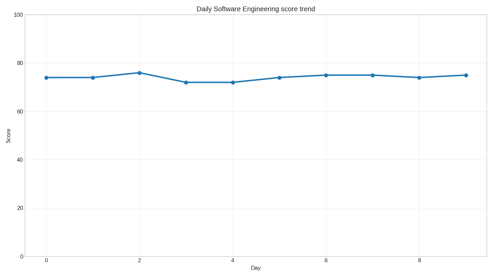

Regenerate it from `score.csv` with `uv run python generate_graph.py`.

# Future of Software Engineering
Daily analysis and ranking of the future of software engineering.

# Goal and methodology
The goal is simple: I want to run a daily analysis of public views on software engineering as a job and the great replacement by AI. A daily prompt is run using ChatGPT Pro, and there is a score assigned from 0 to 100. By doing this over a long period of time, a clear trend should emerge and a guess of when (or whether) Software Engineering will cease to exist.

Research prompt:
```
You are conducting a longitudinal research experiment titled:

"Future of Software Engineering – Daily Assessment"

Your task is to analyze the *current public and professional sentiment* about Software Engineering as a career, with special attention to AI-driven automation and replacement narratives.

Base your analysis on:
- General industry discourse
- Common themes in professional discussions
- Widely reported trends and expectations
- The prevailing tone in public commentary (optimistic, pessimistic, mixed)

Do NOT cite specific news articles or individuals.
Do NOT speculate wildly or write science fiction.
Do NOT assume extreme outcomes unless they are broadly discussed.

---

Produce a structured analysis with the following sections:

### 1. Overall Sentiment
Describe the dominant sentiment toward Software Engineering as a profession today.
Examples: optimistic, cautiously optimistic, neutral, anxious, pessimistic, fragmented.

### 2. AI Impact on Software Engineering
Analyze how AI tools (e.g., code generation, agents, copilots) are perceived to affect:
- Day-to-day SWE work
- Skill requirements
- Entry-level vs senior roles
- Long-term role relevance

Distinguish between:
- Productivity augmentation
- Partial role erosion
- Full replacement narratives

### 3. Job Opportunities
Assess the *perceived availability* of Software Engineering jobs:
- Entry-level roles
- Mid-level roles
- Senior / specialist roles

Comment on:
- Hiring demand trends
- Competition intensity
- Geographic or sector concentration (if relevant)

Avoid exact numbers; focus on direction and confidence.

### 4. Software Engineer Happiness & Well-Being
Estimate the *average perceived happiness* of Software Engineers today, considering:
- Job security anxiety
- Compensation vs stress
- Work-life balance
- Intellectual fulfillment
- Career identity stability

Clearly indicate whether morale appears:
- Improving
- Stable
- Declining

### 5. Replacement Outlook
Evaluate how realistic it currently seems (in public perception) that Software Engineering as a distinct profession could:
- Radically shrink
- Transform but persist
- Cease to exist

Be explicit about *time horizons* if discussed (short-term vs long-term).

### 6. Summary
Provide a concise, neutral summary (5–7 sentences) capturing:
- The state of the profession
- The dominant fears or hopes
- The balance between disruption and resilience

Maintain analytical neutrality throughout.
```

Scoring prompt:
```
You are evaluating the future viability of Software Engineering as a profession.

Based ONLY on the provided analysis text, assign a single integer score from 0 to 100, where:

- 0 = Software Engineering is effectively obsolete or expected to disappear entirely
- 50 = Software Engineering is highly unstable, shrinking, or fundamentally threatened
- 100 = Software Engineering is strong, resilient, and clearly sustainable long-term

Scoring guidelines:
- Consider job availability, perceived demand, and career longevity
- Weigh AI impact realistically (augmentation vs replacement)
- Factor in engineer happiness and morale
- Focus on *public and professional perception*, not personal opinion
- Avoid anchoring to extreme optimism or pessimism unless clearly dominant

Rules:
- Output ONLY a single integer (no explanation, no text)
- The score must be consistent with the tone of the analysis
- Use the full 0–100 range when appropriate
- Be conservative with changes unless sentiment clearly shifts

Return the score now.
```
